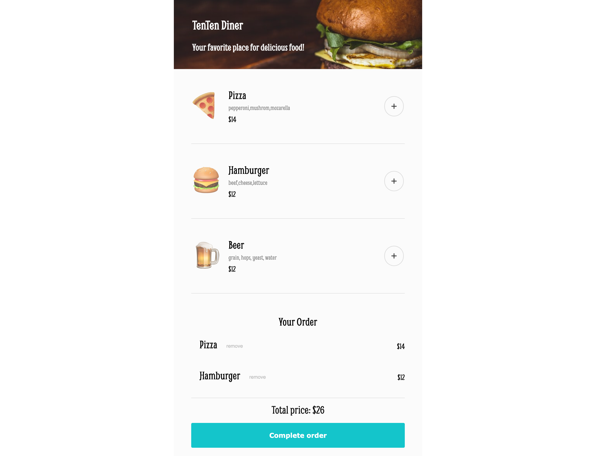

# Food Ordering

A food delivery app

## Tech Used

- HTML
- CSS
- JavaScript

## Features

- Menu browsing - Item descriptions, images, prices
- Add/remove items in the cart and checkout
- Modal payment with compulsory inputs

## Live Demo

[foodorderinapp.netlify.app](https://foodorderinapp.netlify.app/)

## Screenshots

## What I Learned

- Arrow functions
- .reduce() method
